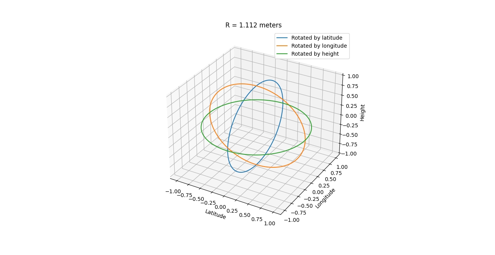
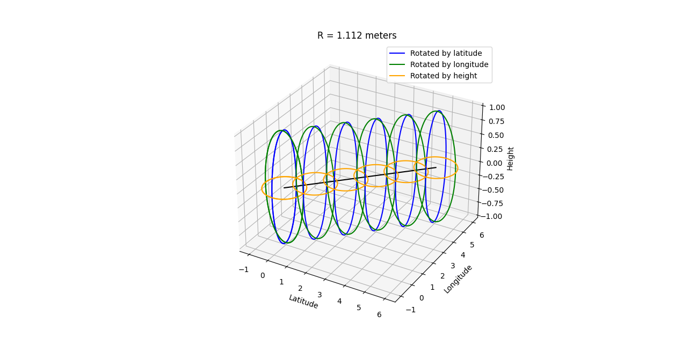

### Các điểm trên đường tròn được tạo ra bằng cách quay vector R một góc 0.5 độ.

Toạ độ GPS của thời điểm hiện tại là tâm của các đường tròn đơn vị

Khi mô phong sự di chuyển của người dùng ta tịnh tiến các đường tròn theo kinh độ và vĩ độ như trong hình.

